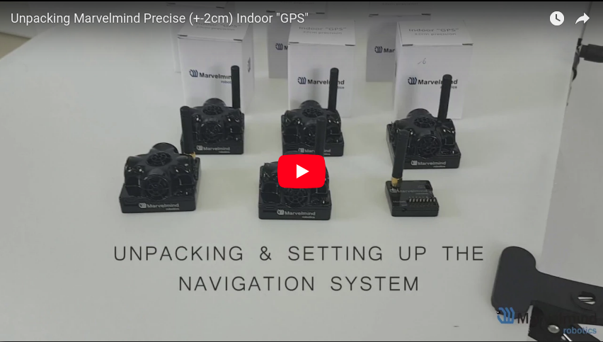

# Marvelmind Indoor 'GPS' Tutorial
A tutorial for the Marvelmind Indoor GPS ultrasonic beacons, seen [here!](https://marvelmind.com/) 

---

This is also the first part of a series of tutorials for [sensor fusion in ROS.](https://github.com/methylDragon/ros-sensor-fusion-tutorial)

### Features

The tutorial teaches you how to do the first-time setup for the beacon system, as well as explains the software interfaces, notably the ROS one!

The Resources, Manuals, and Drivers directory also includes firmware and manuals from Marvelmnd to help you get set up!

---

 [.png)](https://www.buymeacoffee.com/methylDragon)

